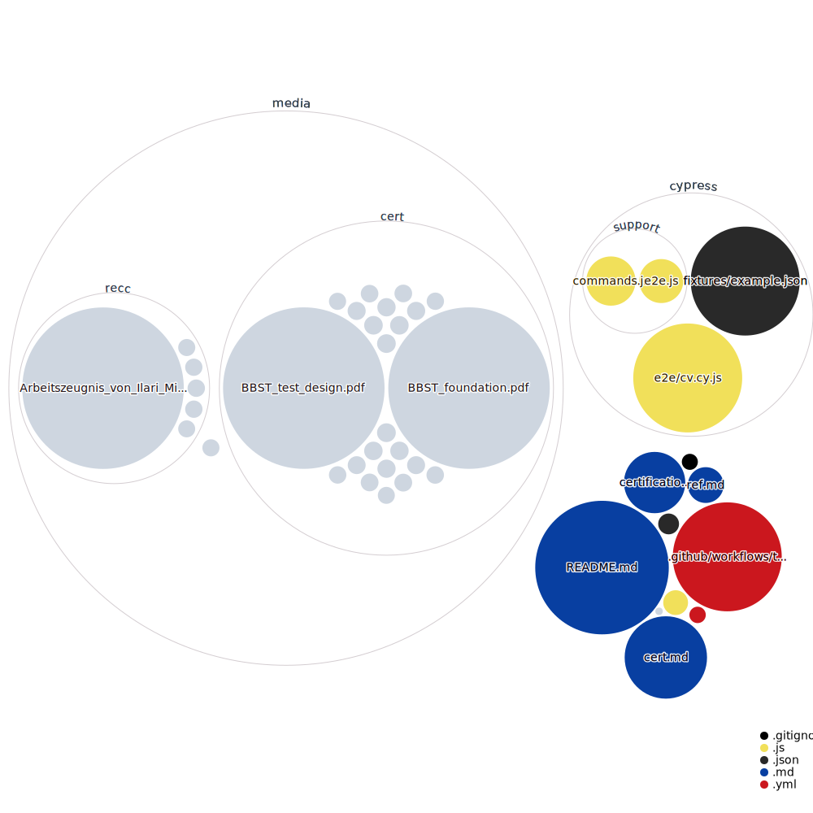

# Michal Zima

[//]: # "[Email](mailto:miso.zima@1337tester.com) / [Website](https://www.1337tester.com) / [LinkedIn](https://www.linkedin.com/in/1337tester/) / [GitHub](https://github.com/1337tester) / [Twitter](https://twitter.com/1337T3st3r) / [Xing](https://www.xing.com/profile/Michal_Zima/cv)"

|  |  |
| ----------- | ----------- |
| Email | miso.zima@1337tester.com |
| Web | www.1337tester.com |
| linkedIn | www.linkedin.com/in/1337tester/ |
| Phone | +41766121224 |
| Nationality | Slovak |
| Date of birth | 17.01.1986 |
| [References](/ref.html)|
| [Certifications](/cert.html) |

## About
Testing for me is searching for order in the chaotic complexity which can emerge from the simplest of designs. It is bringing clarity into uncertainty, bringing value for the stakeholders with the quick and comprehensible information I provide.

While on projects I seek new ways to solve problems, minimize chaos, promote collaboration and build a knowledge base among people. I strive to achieve mutual trust in the form of:

_**"Michal tested this, there will be no surprises"**_

My strength dwells in curiosity to figure out software problems into their atomic essence. I’m currently interested in computer security - web, network and also the physical aspect of it. My methods include scripts to support my testing and I am willing to use trial/error to an extent where most people give up. This helps me create a model of the system which I then refine incrementally. At the end of the day, the feedback from testing itself shows the best approach. You need to always be ready to change the way how you approach the problem.

When you don't see me testing, I am probably doing sports or exploring interesting parts of our planet.

## Professional Activity
#### `2016 - now` **Test Specialist**, [House of Test GmbH, CH/UK](https://houseoftest.ch/)

_With House of Test, I found the ideal company for my testing career. It is full of like-minded people strongly supporting each other._

**[ERGON](https://www.ergon.ch)**
- Test strategy and testing of financial exchange software  
- Different TCP channels – FIX, OUCH, GLIMPSE, ITCH  
- Creating automated scenarios for risk-based test coverage  
- Wireshark / GitLab / python / Linux / Teleport  

**[LGT](https://www.lgt.com/en/)**
- Setting up testing processes from scratch on an ongoing Project for document archiving
- Introducing agile in a light version - sprints, stories
- Powershell scripting to support the testing process - creation of test documents, daily upload, creating batch deletions, etc
- PowerShell / SQL / JIRA / xRay

**[ZKB](https://www.zkb.ch/)**
- Providing testing services in a digitization project for a team undergoing a transformation from waterfall into agile
- Setting up test processes, test data organisation, defect management
- day-to-day investigation on system issues
- TOSCA /powershell / SQL / python / selenium (java)

**[Just Eat UK](https://www.just-eat.co.uk/)**
- Introducing testing practices into two separate Growth teams
- Training junior Colleagues
- Rapid development & testing of multi-variant experiments, ‘fail fast’ approach
- Python  / mobile apps testing (Android Studio)

**[BLKB](https://www.blkb.ch/)**
- Helping the bank with the transition from traditional waterfall testing into a more context-oriented approach
- Avaloq system / financial domain

**[eBay](https://www.ebay.co.uk/) (Intradesys)**
- Delivering an automation checking suite
- Python / Pytest  / Selenium
- Following the coverage with the speed of development and providing additional value with quick testing feedback

**[Swisscom Home Automation](https://www.swisscom.ch)**
- Investigating various aspects of a home automation solution
- Experience with IoT and and various included platforms (smartphone, tablet, web, embedded)

---

#### `2014 – 2016` **Test Consultant**, [Capco, BA](https://www.capco.com/Contact/Locations-archive/Bratislava)
- [Credit Suisse](https://www.credit-suisse.com/ch/de.html)
- Testing of banking systems
- EBA SDD certification tester
- Guiding and teaching junior testers
- Tester at PROD emergency deployments
- Subject matter expert on several topics – EBA, SIX, PF
- Powershell, SQL

---

#### `2012 – 2014` **Automation Test Engineer**, [ERNI, BA](https://www.outsourcing.erni/bratislava)
- [SCOR](https://www.scor.com/en) / [KISTLER](https://www.kistler.com/de/)
- Automated scripts
- Hardware/Software embedded Systems
- Starting work in the Swiss sphere

---

#### `2010 – 2012`**Tester**, [Accenture, BA](https://www.accenture.com/sk-en)
- Kickstart testing career
- Learning the basics
- Enjoying working in my first team

## Skills & Expertise
*   Testing - basically any form, if the system exists I’m motivated and capable to find out how exactly it works at any given moment
*   Scripting - Powershell, Python, Bash
*   Automation in Testing (Selenium - python, java, Tosca)
*   Maintenance of Automated Test Processes
*   Databases – SQL
*   Security testing (OWASP10, networking, forensics)
*   Basically any agile or less agile issue tracking or project managing tool
*   Banking knowhow– various assembled business knowledge from payments, accounting, document processing

#### Languages

English - Full Professional Knowledge  
German - Full Professional Knowledge  
Swiss German - Beginner  
Slovakian - Native Speaker  

#### Education
2004-2009	Comenius University, Faculty of Management, \
	Master in IT Management

2009-now	Owning my education by reading books (testing, psychology, economics), attending onsite or online courses (Coursera, Udemy, BBST, ...) and conferences (3XC3, Defcon, Craft, SoCraTes), mainly security-oriented stuff (broad spectrum from network and security tools to lockpicking)

## References

[You can view my recommendations here](/ref.html)

## Certifications and directions of learning

[You can view my certifications here](/cert.html)